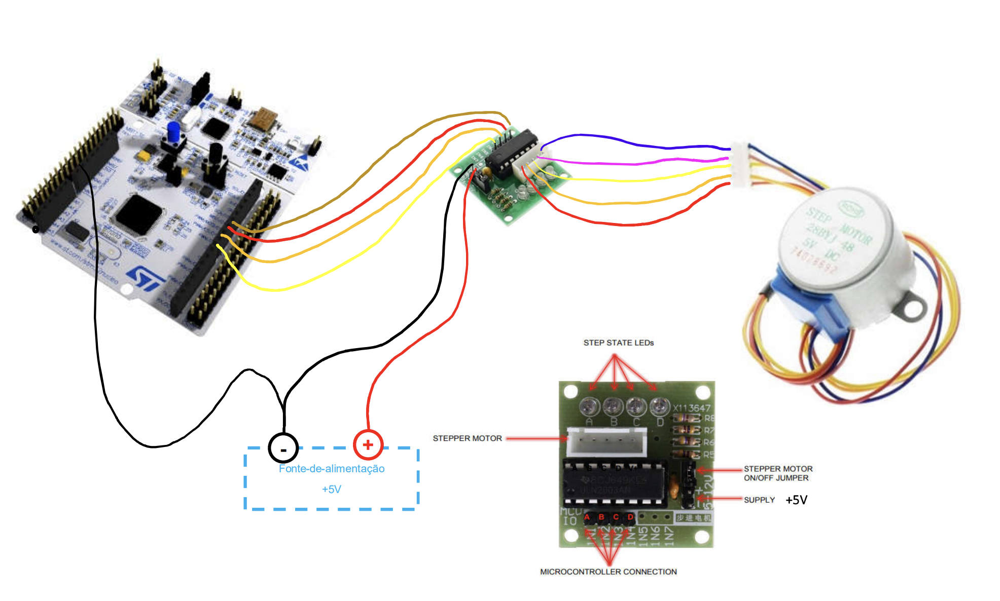
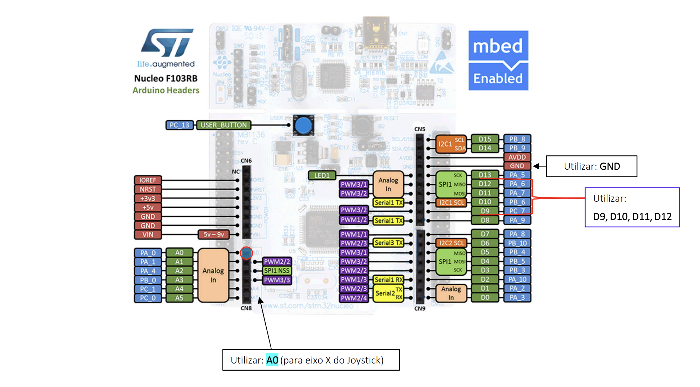
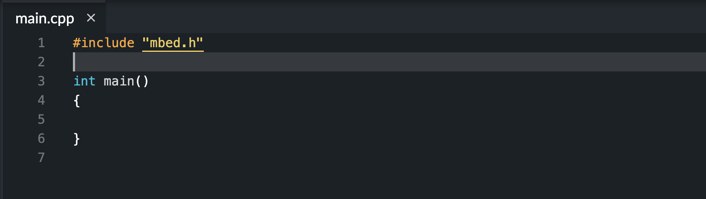

Autor: Wilgner Lopes

# Demonstração de acionamento de motores utilizando classes em C++ no Keil Studio

## Objetivo

- Realizar o acionamento de um motor de passo no modo automatico e utilizando o JoyStick atraves de classes com C++

## Introdução

- O objetivo desse tutorial é auxiliar o aluno na construção de classes em C++ que permitam acionar um motor de passo conectado em uma placa **NUCLEO-F103** 

### Requisitos

- Placa NUCLEO-F103
- Motor de passo unipolar 4 fases (Ex: Nema 23 AK23 ou 28BY)
- Driver do motor de passo (Exemplo: ULN2003 ou Transistor MOSFET)
- JoyStick

### Esquematico da ligação:
---

### Ligação entre os componentes


### Pinagem na placa nucleo


### Pratica

1. Crie um projeto novo no keil studio com a versão 2 do mbed e deixe o projeto vazio como na imagem a seguir: 



2. Crie na raiz do projeto dois arquivos ```Motor.h``` e ```Motor.cpp```

3. No arquivo ```Motor.h``` coloque o seguinte codigo:

```cpp
#ifndef MBED_MOTOR_H
#define MBED_MOTOR_H
 
#include "mbed.h"
 
class Motor{
    public:
       Motor(PinName pin1, PinName pin2, PinName pin3, PinName pin4);
        void gira_motor_sentido_horario(int tempo);
        void gira_motor_sentido_antihorario(int tempo);
        void stop();
    private:
        BusOut bus;
}; 
 
 
#endif

```

4. No arquivo ```Motor.cpp```coloque o seguinte codigo:

```cpp
#include "Motor.h"
#include "mbed.h"

Motor::Motor(PinName pin1, PinName pin2, PinName pin3, PinName pin4) :  bus(pin1, pin2, pin3, pin4){}
    

void Motor::gira_motor_sentido_horario(int tempo){
    bus.write(0x08);
    wait_ms(tempo);
    bus.write(0x04);
    wait_ms(tempo);
    bus.write(0x02);
    wait_ms(tempo);
    bus.write(0x01);
    wait_ms(tempo);
}

void Motor::gira_motor_sentido_antihorario(int tempo){
    bus.write(0x01);
    wait_ms(tempo);
    bus.write(0x02);
    wait_ms(tempo);
    bus.write(0x04);
    wait_ms(tempo);
    bus.write(0x08);
    wait_ms(tempo);
    
}

void Motor::stop(){
    bus.write(0x00);
}

```

5. No arquivo ```Motor.h``` colocamos as interfaces da classe que basicamente são as declarações dos metodos que serão utilizados. No Arquivo ```Motor.cpp``` colocamos as implementações de cada metodo descrito no arquivo de interfaces.

6. Agora vamos implementar o codigo dentro do arquivo ```main.cpp```:

Primeiro vamos declarar os pinos que vamos utilizar e importar a biblioteca do mbed e a nossa classe:
```cpp
#include "mbed.h"
#include "Motor.h"

Motor motor1(D12, D11, D10, D9);

InterruptIn botao(USER_BUTTON);

AnalogIn EixoYJoyStick(A0);
```
Após isso, vamos declarar nossas variaveis de controle:
```cpp

int tempo = 2;
int y;
bool referenciamento = 0;
int contador = 0;
int valor_inicial_x = 0;
int valor_final_x = 500;
int flag_referenciamento_x = 1;
int etapa = 2;

int lista_pos_x[8];
int pos_atual_x;
int flag_jogManual = 1;
int contador_x = 0;
int estado = 1;
```
Com as variaveis declaradas, vamos criar nossa função responsavel pelo joystick e nossa função de interrupção:

```cpp
void jogManual(){
    
    while(estado == 3){
        motor1.stop();
        contador_x = pos_atual_x;
        y = EixoYJoyStick.read() * 1000;
        while(y > 800 && flag_jogManual == 1){
            y = EixoYJoyStick.read() * 1000;
            if(contador_x >= valor_final_x){
                contador_x = valor_final_x;
                motor1.stop();
                continue;
            } else {
                motor1.gira_motor_sentido_antihorario(tempo);
                contador_x += 1;
            }
            
        }

        while(y < 200 && flag_jogManual == 1){
            y = EixoYJoyStick.read() * 1000;
            if(contador_x <= valor_inicial_x){
                contador_x = valor_inicial_x;
                motor1.stop();
                continue;
            } else {
                motor1.gira_motor_sentido_horario(tempo);
                contador_x -= 1;
            }
        }

        pos_atual_x = contador_x;
    }
}

void toggle_button(){
    estado++;
    if(estado > 3){
        estado = 1;
    }
}

```

Agora com tudo declarado e implementado, vamos construir nossa função principal que tera 3 estados que geram determinados por um switch-case:
- Girar o motor no sentido horario
- Girar o motor no sentido antihorario
- Realizar o jogManual

```cpp
int main() {
    botao.fall(&toggle_button);
    while(1) {

        switch (estado) {
        case 1:
            motor1.gira_motor_sentido_antihorario(tempo);
            break;
        case 2:
            motor1.gira_motor_sentido_horario(tempo);
            break;
        case 3:
            jogManual();
            break;
        }


    }
}
```

- Feito tudo isso, basta compilar o codigo e enviar para a placa NUCLEO.
